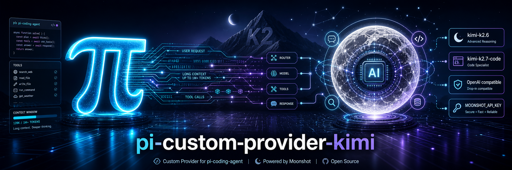

# Custom Provider: Kimi



A custom provider extension that exposes selected Kimi models through Kimi Open Platform's OpenAI-compatible Chat Completions API.

## Install

```bash
# Install globally
pi install git:github.com/vedang/pi-custom-provider-kimi

# Or install for just the current project
pi install -l git:github.com/vedang/pi-custom-provider-kimi
```

## Features

- Uses Kimi OpenAI-compatible endpoint: `https://api.moonshot.ai/v1`
- Enables models only when `MOONSHOT_API_KEY` is present
- Registers only:
  - `kimi-k2.6`
  - `kimi-k2.7-code`
  - `kimi-k2.7-code-highspeed`
- Forces Kimi-required sampling values (`temperature: 1.0` when thinking, `0.6` for K2.6 non-thinking, and `top_p: 0.95`)
- Preserves thinking for tool-call continuity; K2.7 correctly remains thinking-only
- Uses dedicated API id `kimi-custom-openai-completions` while delegating to OpenAI-compatible transport

## Configuration

```bash
export MOONSHOT_API_KEY="your-kimi-api-key"
```

The provider is registered as `kimi-custom`.

## Model IDs

| model_id | Example selector | Notes |
| --- | --- | --- |
| `kimi-k2.6` | `kimi-custom/kimi-k2.6` | Multimodal K2.6 model |
| `kimi-k2.7-code` | `kimi-custom/kimi-k2.7-code` | K2.7 code-focused model |
| `kimi-k2.7-code-highspeed` | `kimi-custom/kimi-k2.7-code-highspeed` | Same K2.7 Code model, faster serving tier |

## Model Matrix

All registered models use:

- Endpoint: `https://api.moonshot.ai/v1`
- API: OpenAI Chat Completions compatible
- Context Window: 262,144 tokens
- Default/advertised output length: 32,768 tokens
- Inputs: text, image
- Tool calls: supported by Kimi API
- JSON Mode / Partial Mode: supported by Kimi API

### Pricing metadata

Costs are dollars per 1M tokens and follow Kimi pricing pages.

| Model | Cache-hit input | Cache-miss input | Output |
| --- | ---: | ---: | ---: |
| `kimi-k2.6` | $0.16 | $0.95 | $4.00 |
| `kimi-k2.7-code` | $0.19 | $0.95 | $4.00 |
| `kimi-k2.7-code-highspeed` | $0.38 | $1.90 | $8.00 |

## Development

```bash
make init
make format
make check
make test
```

## Notes

Kimi docs state K2.6/K2.7 Code accept only fixed sampling values. This provider deliberately overrides caller or role-level sampling knobs to avoid request errors. K2.6 follows pi's thinking toggle; K2.7 rejects non-thinking mode and is therefore always registered with thinking enabled.
